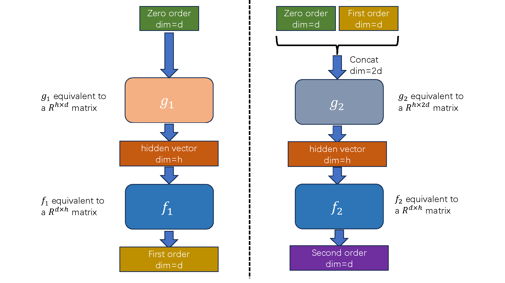

## Rectified Flow

> By JamesSand


<!-- I have also implement a google colab. You can find the colab [here](https://colab.research.google.com/drive/11pCMnpmV9H2cRhvT1mF1pVk_ySH3q0XZ?usp=sharing) -->

### 0 Releated Works

Here is the code for training the second order model. 

Please cite our related papers which using second order method.

[High-Order Matching for One-Step Shortcut Diffusion Models](https://arxiv.org/pdf/2502.00688)

```bibtex
@article{chen2025high,  
  title={High-Order Matching for One-Step Shortcut Diffusion Models},  
  author={Chen, Bo and Gong, Chengyue and Li, Xiaoyu and Liang, Yingyu and Sha, Zhizhou and Shi, Zhenmei and Song, Zhao and Wan, Mingda},  
  journal={arXiv preprint arXiv:2502.00688},  
  year={2025}  
}
```

[Hofar: High-order augmentation of flow autoregressive transformers](https://arxiv.org/pdf/2503.08032)
```bibtex
@article{liang2025hofar,  
  title={Hofar: High-order augmentation of flow autoregressive transformers},  
  author={Liang, Yingyu and Sha, Zhizhou and Shi, Zhenmei and Song, Zhao and Wan, Mingda},  
  journal={arXiv preprint arXiv:2503.08032},  
  year={2025}  
}
```

[Force Matching with Relativistic Constraints: A Physics-Inspired Approach to Stable and Efficient Generative Modeling](https://arxiv.org/pdf/2502.08150)
```bibtex
@article{cao2025force,  
  title={Force Matching with Relativistic Constraints: A Physics-Inspired Approach to Stable and Efficient Generative Modeling},  
  author={Cao, Yang and Chen, Bo and Li, Xiaoyu and Liang, Yingyu and Sha, Zhizhou and Shi, Zhenmei and Song, Zhao and Wan, Mingda},  
  journal={arXiv preprint arXiv:2502.08150},  
  year={2025}  
}
```


<!-- #### Loss curve

First order loss is ok. But second order loss has some spikes.

<div style="display: flex; justify-content: center; gap: 10px;">
  
</div>

<br>

<div style="display: flex; justify-content: center; gap: 10px;">
  
</div>

<br>

<div style="display: flex; justify-content: center; gap: 10px;">
  
</div> -->


##### Model Architecture

<div style="display: flex; justify-content: center; gap: 10px;">
  
</div>

The First Order model is defined at [here](https://github.com/JamesSand/SecondOrderRectifiedFlow/blob/f5c8bfc438152149b5fb0d571f56abebc123edde/second_order_code.py#L72)

```python
class MLP(nn.Module):
    def __init__(self, input_dim=2, hidden_num=100):
        super().__init__()
        self.fc1 = nn.Linear(input_dim+1, hidden_num, bias=True)
        self.fc2 = nn.Linear(hidden_num, hidden_num, bias=True)
        self.fc3 = nn.Linear(hidden_num, input_dim, bias=True)
        self.act = lambda x: torch.tanh(x)

    def forward(self, x_input, t):
        # We only input zero order here, so we have a dimension d input
        inputs = torch.cat([x_input, t], dim=1)
        x = self.fc1(inputs)
        x = self.act(x)
        x = self.fc2(x)
        x = self.act(x)
        x = self.fc3(x)

        return x
```

The Second Order model is defined at [here](https://github.com/JamesSand/SecondOrderRectifiedFlow/blob/f5c8bfc438152149b5fb0d571f56abebc123edde/second_order_code.py#L90)
```python
class MLP_2nd_order(nn.Module):
    def __init__(self, input_dim=2, hidden_num=100):
        super().__init__()
        self.fc1 = nn.Linear(input_dim + input_dim + 1, hidden_num, bias=True)
        self.fc2 = nn.Linear(hidden_num, hidden_num, bias=True)
        self.fc3 = nn.Linear(hidden_num, input_dim, bias=True)
        self.act = lambda x: torch.tanh(x)

    def forward(self, first_order_input, x_input, t):
        # We concate zero order and first order here, to get a dimension 2d input
        inputs = torch.cat([first_order_input, x_input, t], dim=1)
        x = self.fc1(inputs)
        x = self.act(x)
        x = self.fc2(x)
        x = self.act(x)
        x = self.fc3(x)

        return x
```


##### Visualization Result

first order weight: 1; second order weight: 1e-11

<div style="display: flex; justify-content: center; gap: 10px;">
  
  
</div>

first order weight: 1; second order weight: 1e-8

<div style="display: flex; justify-content: center; gap: 10px;">
  
  
</div>

first order weight: 1e6; second order weight: 1

<div style="display: flex; justify-content: center; gap: 10px;">
  
  
</div>

 


<!-- #### Gradient norm

The gradient norm is reported under: first order weight: 1e6; second order weight: 1

> Zhizhou Sha: I have little sence about grad norm. I am not sure when should we clip the grad?

<div style="display: flex; justify-content: center; gap: 10px;">
  
</div>

<br>

<div style="display: flex; justify-content: center; gap: 10px;">
  
</div> -->


### 1 Env setup

```bash
pip install -r requirements.txt
```

### 2 Run code
```bash
python second_order_code.py
```

### 3 Visualize results

Please refer to `model_eval.ipynb`


