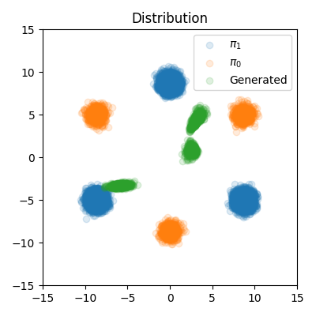
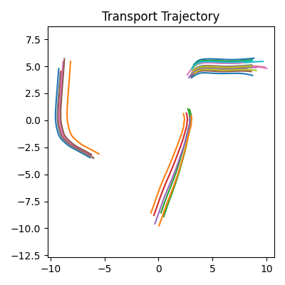

## Rectified Flow

> By JamesSand

### 0 Current result

I have trained the second order model. The loss curve is not so good. But the visualization result is quite reasonable.

#### Loss curve

#### Visualization Result

<div style="display: flex; justify-content: center; gap: 10px;">
  
  
</div>


### 1 Env setup

```bash
pip install -r requirements.txt
```

### 2 Run code
```bash
python second_order_code.py
```

### 3 Visualize results

Please refer to `model_eval.ipynb`


