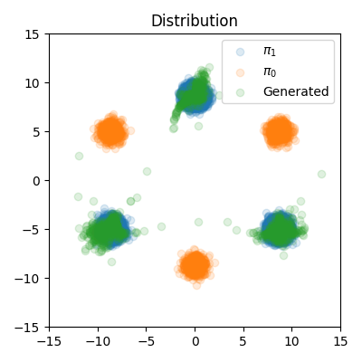
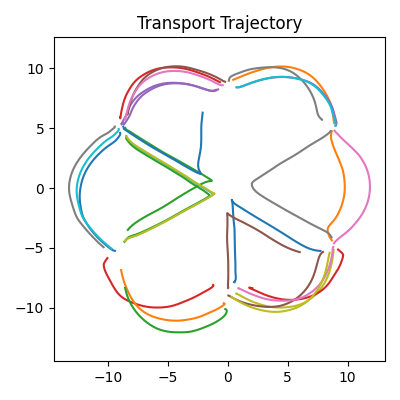
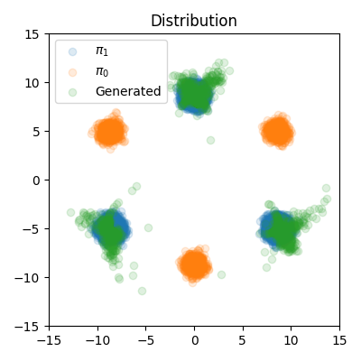
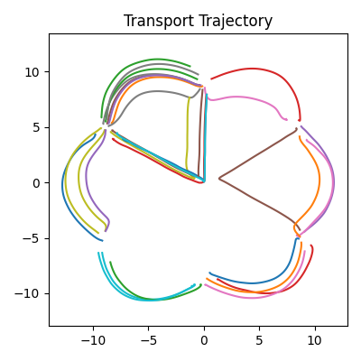
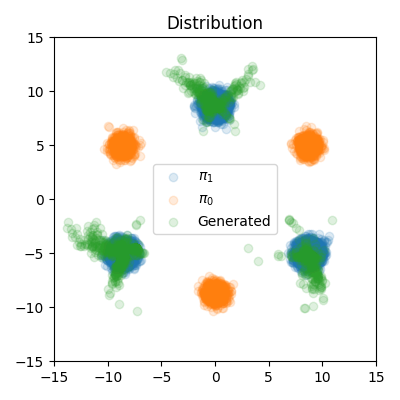
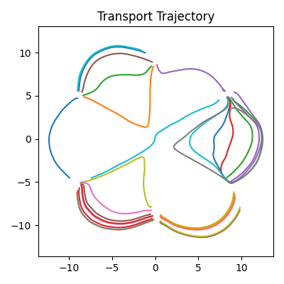
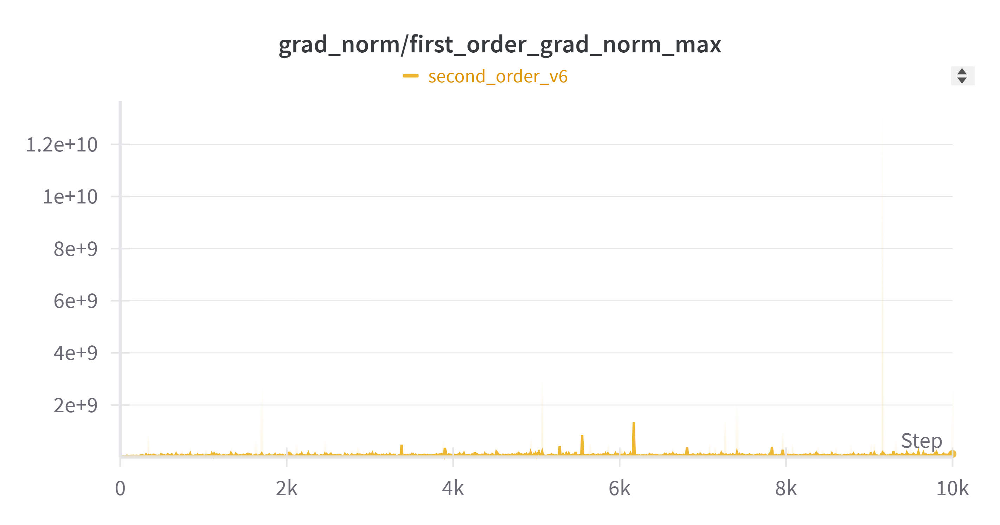
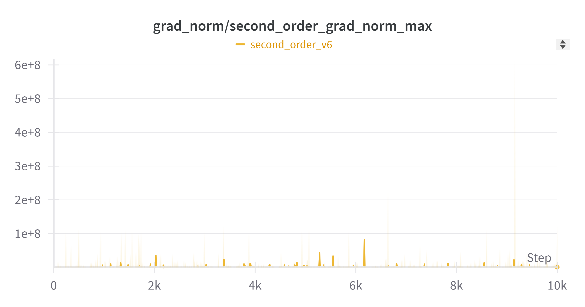

## Rectified Flow

> By JamesSand


<!-- I have also implement a google colab. You can find the colab [here](https://colab.research.google.com/drive/11pCMnpmV9H2cRhvT1mF1pVk_ySH3q0XZ?usp=sharing) -->

### 0 Current result

Here is the code for training the second order model. Please cite our related papers which using second order method.

@article{chen2025high,
  title={High-Order Matching for One-Step Shortcut Diffusion Models},
  author={Chen, Bo and Gong, Chengyue and Li, Xiaoyu and Liang, Yingyu and Sha, Zhizhou and Shi, Zhenmei and Song, Zhao and Wan, Mingda},
  journal={arXiv preprint arXiv:2502.00688},
  year={2025}
}

@article{cao2025force,
  title={Force Matching with Relativistic Constraints: A Physics-Inspired Approach to Stable and Efficient Generative Modeling},
  author={Cao, Yang and Chen, Bo and Li, Xiaoyu and Liang, Yingyu and Sha, Zhizhou and Shi, Zhenmei and Song, Zhao and Wan, Mingda},
  journal={arXiv preprint arXiv:2502.08150},
  year={2025}
}

<!-- #### Loss curve

First order loss is ok. But second order loss has some spikes.

<div style="display: flex; justify-content: center; gap: 10px;">
  
</div>

<br>

<div style="display: flex; justify-content: center; gap: 10px;">
  
</div>

<br>

<div style="display: flex; justify-content: center; gap: 10px;">
  
</div> -->


#### Visualization Result

first order weight: 1; second order weight: 1e-11

<div style="display: flex; justify-content: center; gap: 10px;">
  
  
</div>

first order weight: 1; second order weight: 1e-8

<div style="display: flex; justify-content: center; gap: 10px;">
  
  
</div>


first order weight: 1e6; second order weight: 1

<div style="display: flex; justify-content: center; gap: 10px;">
  
  
</div>

<!-- #### Gradient norm

The gradient norm is reported under: first order weight: 1e6; second order weight: 1

> Zhizhou Sha: I have little sence about grad norm. I am not sure when should we clip the grad?

<div style="display: flex; justify-content: center; gap: 10px;">
  
</div>

<br>

<div style="display: flex; justify-content: center; gap: 10px;">
  
</div> -->


### 1 Env setup

```bash
pip install -r requirements.txt
```

### 2 Run code
```bash
python second_order_code.py
```

### 3 Visualize results

Please refer to `model_eval.ipynb`


